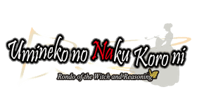

<h1 align="center">
<br>
Umineko no Naku Koro ni · PSVita Port
</h1>
<p align="center">
  <a href="#setup-instructions-for-end-users">How to install</a> •
  <a href="#controls">Controls</a> •
  <a href="#customization">Customization</a> •
  <a href="#known-issues">Known issues</a> •
  <a href="#build-instructions-for-developers">How to compile</a> •
  <a href="#credits">Credits</a> •
  <a href="#disclaimer">Disclaimer</a> •
  <a href="#license">License</a>
</p>

> Umineko no Naku Koro ni is a visual novel by 07th Expansion. October 4th, 1986: the Ushiromiya family gathers on the private island of Rokkenjima for the annual family conference, as a typhoon closes in and the legend of the Golden Witch, Beatrice, starts to come true.

This repository contains a PS Vita port of the **[Umineko Project](https://www.umineko-project.org/)** release of the game — the fan port of the PS3 version ("Umineko no Naku Koro ni Rondo of the Witch and Reasoning" / "Nocturne of Truth and Illusions", featuring PS3 artwork, full voice acting, and videos) running on an optimized build of the **ONScripter-RU** engine that allows the game to run smoothly on the PS Vita.

The engine has been **heavily modified and optimized for the PS Vita**: hardware video decoding through the Vita's native media framework, a rewritten textbox and HUD presentation pipeline, memory allocation and loading-time optimizations, and assets tailored specifically for the Vita's display and hardware limits.

> **About Version 1.1:** 
> Version 1.1 adds multi-language support (**English**, **Japanese**, **Brazilian Portuguese**, and **Spanish**), performance improvements, and bug fixes.
>
> The porting work was executed with AI assistance and supervised and tested on real hardware by a human. Parts of every chapter, menus, saving/loading, and videos have been verified on hardware, but **the full game has not been play-tested from start to finish**. If you encounter an issue (a crash, stuck scene, or graphical glitch), please [open an issue](https://github.com/stoicpingu/umineko-vita/issues) detailing where in the story it occurred.

A short legal note appears in the [Disclaimer](#disclaimer) section near the bottom of this page — please read it before downloading anything.

---

## Setup Instructions (For End Users)

In order to properly install the game, follow these steps:

1. **Install kubridge**: Download [kubridge](https://github.com/bythos14/kubridge/releases/) and copy `kubridge.skprx` to your taiHEN plugins folder (usually `ur0:tai/`). Add it to your `ur0:tai/config.txt` under `*KERNEL`:
   ```text
   *KERNEL
   ur0:tai/kubridge.skprx
   ```
2. **Extract Shader Compiler**: Ensure `libshacccg.suprx` is present in `ur0:/data/`. If missing, follow [this guide](https://samilops2.gitbook.io/vita-troubleshooting-guide/shader-compiler/extract-libshacccg.suprx) to extract it.
3. **Game Ownership**: Ensure you legally own the required original games per the [Umineko Project copyright message](https://www.umineko-project.org/en/copyright-message/).
4. **Download & Extract Base Game Data**: Download the main game data archive [`umineko-vita-release.zip`](https://drive.google.com/file/d/1onPuW4rIEvKBaPn4ZX_vYy0WexlTkG01/view?usp=sharing) (~4.8 GB). **You need this archive, not the Umineko Project's PC download**: the assets in it were resized and re-encoded for the Vita's screen, memory and hardware video decoder, and the configuration files were made specifically for this port — the PC files will not work with it. The archive is **password protected** with the Umineko Project's own passphrase, exactly like their releases: owners of the games can build it from their manual and game files as described in the [copyright message](https://www.umineko-project.org/en/copyright-message/) (just google things ;)). The password is not published here. Extract the archive to obtain the `umineko` folder, and copy it to `ux0:data/` on your Vita so that the path is `ux0:data/umineko/`.
5. **Install English Hotfix**: Download and install the [English Hotfix](https://drive.google.com/file/d/19PtCyNjt13L0ylhAWaDcPSOH68gW9ojE/view?usp=drive_link). Extract and copy its contents into `ux0:data/umineko/`, overwriting existing files when prompted.
6. **(Optional) Install Language Addons**:
   - Language addons are available for **[Japanese (JP)](https://drive.google.com/file/d/11_y92UMVBXb-yFNN5KaO3Up25Jr22q1A/view?usp=drive_link)**, **[Brazilian Portuguese (PT-BR)](https://drive.google.com/file/d/1iQNFmuhpnWUwzsGJfr58sutvoaR72x6j/view?usp=drive_link)**, and **[Spanish (ES)](https://drive.google.com/file/d/1jTuhnCQhlD7dvvk1W61MRKE-_u6mvDdK/view?usp=drive_link)**.
   - All language addons install identically: extract the zip and copy the `umineko` folder directly to `ux0:data/`, overwriting any existing files when prompted.
   - > ⚠️ **Save File Compatibility Note:** Each language runs its own dedicated script file (`en.file`, `jp.file`, `pt.file`, `es.file`) and maintains separate save states. Story progress saved in English cannot be loaded when playing in Japanese or another language, and vice-versa.
7. **Install VPK**: Download and install `umineko.vpk` from the [Releases](https://github.com/stoicpingu/umineko-vita/releases/latest) page.

The final layout under `ux0:data/umineko/` should look like this:

```text
ux0:data/umineko/
├── libmain.so          (the game engine)
├── en.file             (English script; jp.file, pt.file, or es.file for other languages)
├── ons.cfg             (configuration settings, see Customization)
├── default.cfg
├── game.hash
├── render_scale.txt
├── backgrounds/
├── fonts/
├── graphics/
├── legacy/
├── sound/
├── sprites/
├── video/
└── save/               (save files and pre-rendered caches)
```

Do not rename or move files inside `ux0:data/umineko/` — the game validates its file integrity against `game.hash` on startup.

---

## Controls

| Button | Action |
|:---:|:---|
| ![cross] | Advance text / confirm / skip effect |
| ![circl] | Open Save screen during reading; back / close in menus and backlog |
| ![trian] | Toggle text window visibility; back / close in menus |
| ![squar] | Toggle Auto mode (any button turns it off) |
| ![start] | Open / close System & Save menu |
| ![selec] | Toggle Mute |
| ![trigl] | Open Backlog / Page up |
| ![trigr] | Toggle Skip mode / Page down |
| ![dpadh] / ![dpadv] / ![joysl] | Menu & choice navigation; Right advances text |
| ![joysr] | Scroll Backlog up / down |

**Touch Controls:** Touch controls are also supported for advancing text, menu selection, toggling menus, and scrolling through the backlog.

---

## Customization

In-game settings (volumes, per-character voice toggles, text speed, auto-mode speed, and textbox styling) can be configured directly from the game's **Config** menu (![start]).

Additional engine behavior can be customized by editing `ux0:data/umineko/ons.cfg` with any plain text editor:

| Configuration Flag | Description |
|---|---|
| `font-multiplier=b1:1.15,b5:1.15` | Dialogue text scaling. `1.15` scales text 15% larger than original PS3 size for improved readability on the Vita display. Keep both values identical (`1.0` is original size). |
| `env[loadlog]=false` | Fast loading mode (~7s load times). Set to `true` to rebuild the full backlog on save load (~20s extra per load). |
| `env[legacy_op]=true` | Enables the legacy PS3 opening video. |

---

## Known Issues

- **Not fully play-tested:** Parts of every chapter, menus, saves, and videos have been verified on Vita hardware, but the full game has not been played end-to-end. Please report any anomalies on the [Issues](https://github.com/stoicpingu/umineko-vita/issues) tracker.

---

## Build Instructions (For Developers)

### Prerequisites

To compile the loader and native components, you will need:
- A [vitasdk](https://github.com/vitasdk) toolchain compiled for `softfp` ABI.
- [vitaShaRK](https://github.com/Rinnegatamante/vitaShaRK) (`make install`).
- [kubridge](https://github.com/bythos14/kubridge) (`cmake -B build && make -C build install`).
- [vitaGL](https://github.com/Rinnegatamante/vitaGL) built with:
  ```bash
  make SOFTFP_ABI=1 CIRCULAR_VERTEX_POOL=2 HAVE_GLSL_SUPPORT=1
  ```

### Building the Loader & VPK

```bash
cmake -S . -B build
cmake --build build
```

This generates `build/eboot.bin` and `build/umineko.vpk`.

---

## Credits

- **[Umineko Project](https://www.umineko-project.org/)** — For the PS3-fication port, engine base, and asset pipeline.
- **[07th Expansion](https://07th-expansion.net/) / Ryukishi07** — For *Umineko no Naku Koro ni*, and Alchemist for the PS3 release.
- **Translation Teams & Authors**:
  - **English**: [Umineko Project](https://www.umineko-project.org/)
  - **Japanese**: AuroraWright ([JP Patch 1.3](https://github.com/AuroraWright/))
  - **Brazilian Portuguese**: [Knox Translations](https://knox.fansub.com.br/)
  - **Spanish**: [Universo When They Cry](https://universowtc.github.io/)
- **[Rinnegatamante](https://github.com/Rinnegatamante/)** — For vitaGL, vitaShaRK.
- **[bythos14](https://github.com/bythos14/)** — For kubridge.
- **[Spazzery](https://gbatemp.net/members/spazzery.495271/)** — For suggestions and motivation.
- **PS Vita Community** — Everyone on Reddit and Discord keeping Vita development active.

---

## Disclaimer

*Umineko no Naku Koro ni* is copyright © 07th Expansion. The PlayStation 3 version was developed and published by Alchemist. *Umineko no Naku Koro ni*, its logo, characters, music, voices, artwork, and all related trademarks are property of their respective owners.

This repository contains only source code for the Vita port and engine modifications. Game assets are distributed separately in compliance with the [Umineko Project copyright terms](https://www.umineko-project.org/en/copyright-message/): for private, non-commercial use by individuals who own the original games.

---

## License

The port loader is licensed under the MIT License — see [LICENSE](LICENSE). The engine modifications to ONScripter-RU are distributed under GNU GPL v2 / BSD 3-Clause — see [licenses/](licenses/).

[cross]: https://raw.githubusercontent.com/v-atamanenko/sdl2sand/master/img/cross.svg "Cross"
[circl]: https://raw.githubusercontent.com/v-atamanenko/sdl2sand/master/img/circle.svg "Circle"
[squar]: https://raw.githubusercontent.com/v-atamanenko/sdl2sand/master/img/square.svg "Square"
[trian]: https://raw.githubusercontent.com/v-atamanenko/sdl2sand/master/img/triangle.svg "Triangle"
[joysl]: https://raw.githubusercontent.com/v-atamanenko/sdl2sand/master/img/joystick-left.svg "Left Joystick"
[joysr]: https://raw.githubusercontent.com/v-atamanenko/sdl2sand/master/img/joystick-right.svg "Right Joystick"
[dpadh]: https://raw.githubusercontent.com/v-atamanenko/sdl2sand/master/img/dpad-left-right.svg "D-Pad Left/Right"
[dpadv]: https://raw.githubusercontent.com/v-atamanenko/sdl2sand/master/img/dpad-top-down.svg "D-Pad Up/Down"
[selec]: https://raw.githubusercontent.com/v-atamanenko/sdl2sand/master/img/dpad-select.svg "Select"
[start]: https://raw.githubusercontent.com/v-atamanenko/sdl2sand/master/img/dpad-start.svg "Start"
[trigl]: https://raw.githubusercontent.com/v-atamanenko/sdl2sand/master/img/trigger-left.svg "Left Trigger"
[trigr]: https://raw.githubusercontent.com/v-atamanenko/sdl2sand/master/img/trigger-right.svg "Right Trigger"
